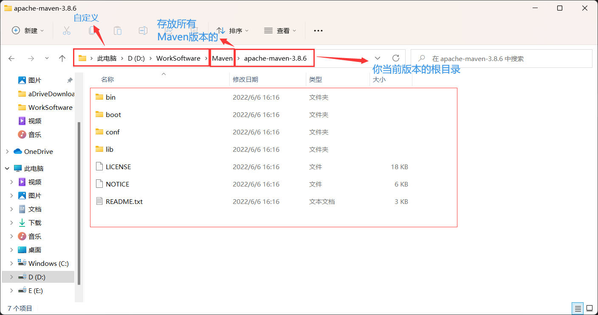
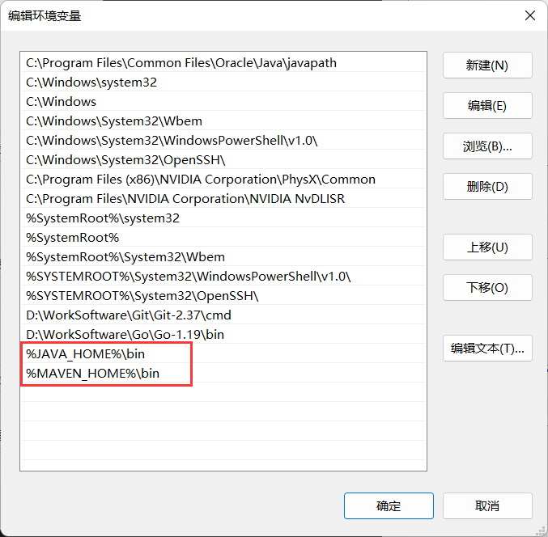
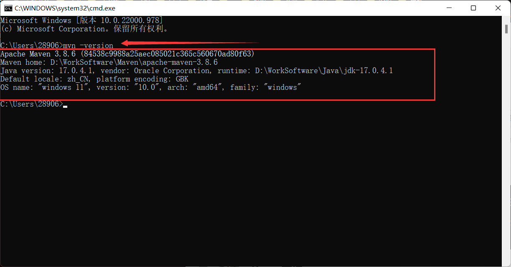
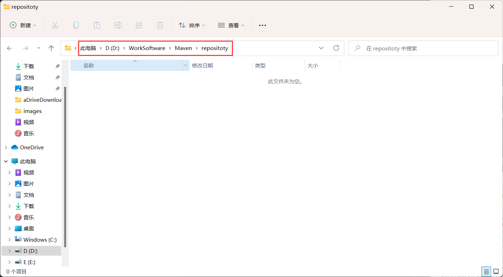
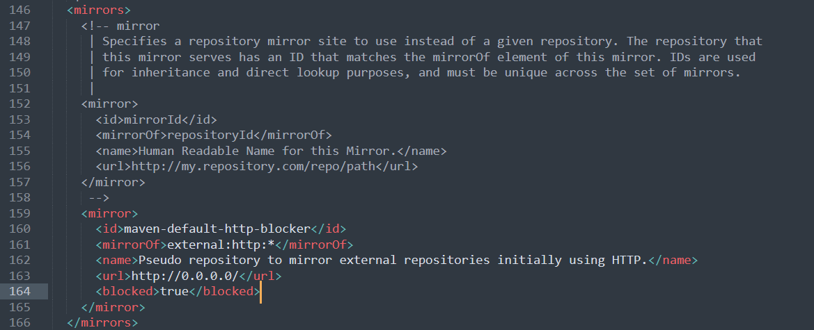
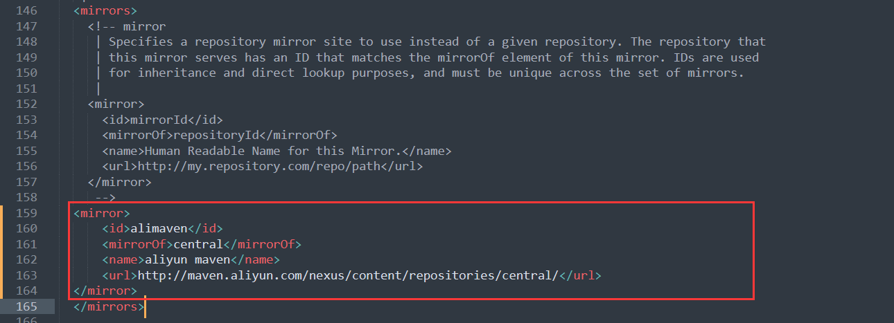
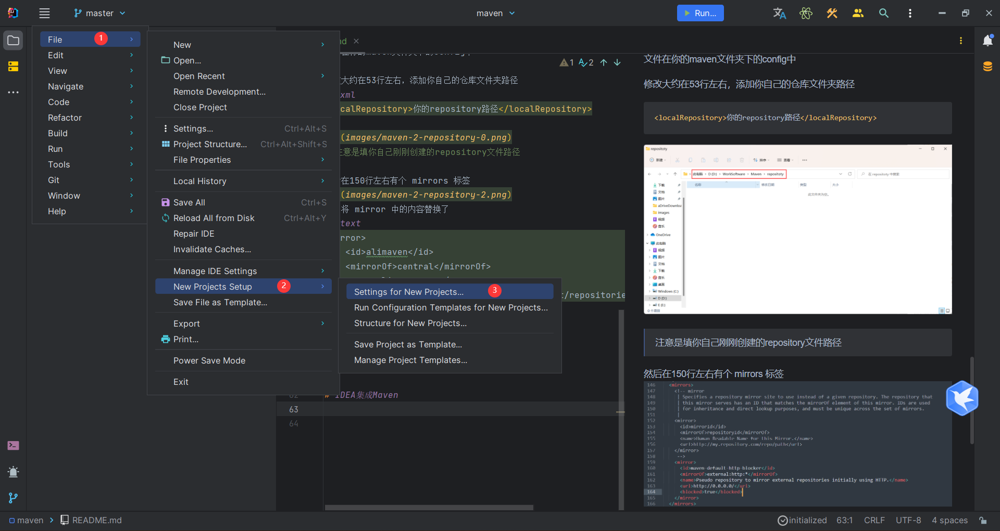
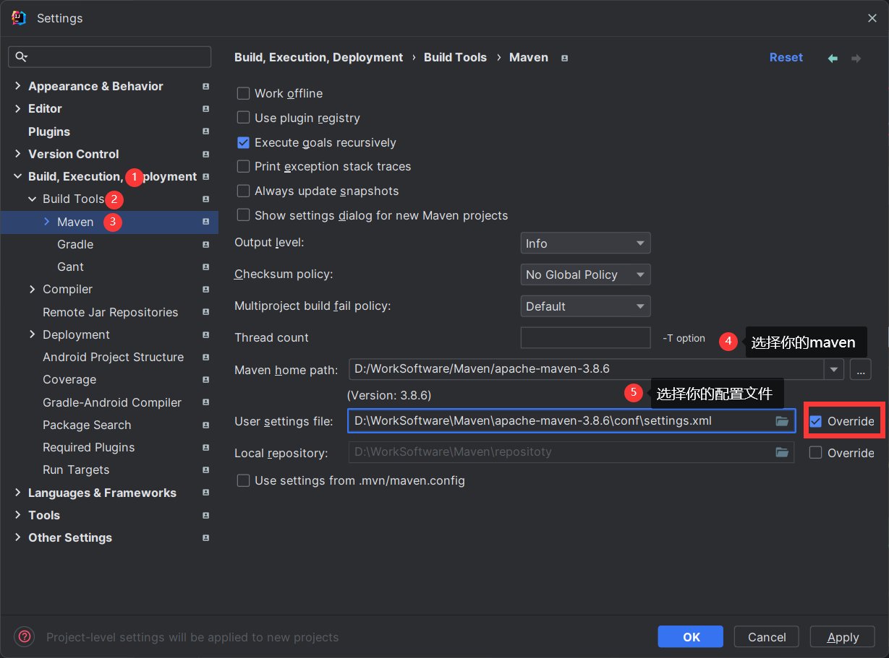

# 1.Maven安装

## 1.1下载
链接：https://maven.apache.org/download.cgi
> windows用户直接现在bin.zip结尾的文件
> 

## 1.2解压

### 1.2.1注意解压路径


## 1.3配置环境变量

### 1.3.1在系统变量中添加MAVEN_HOME
> 方法类似我们添加JAVA_HOME相同
> 

### 1.3.2在Path系统变量中去引用MAVNE_HOME

> 可以看到和设置JAVA_HOME的方法类似

### 1.3.3测试环境是否成功
- <kbd>win</kbd> + <kbd>R</kbd>
- 输入 cmd 然后 <kbd>Enter</kbd>
- 输入 `mvn -version`

> 如图所示，那么你已经成功了
> 

# 2.Maven设置

## 2.1新建一个仓库文件夹

> 可以就和我一样创建在maven文件夹下

## 2.2修改settings.xml文件
文件在你的maven文件夹下的config中

修改大约在53行左右，添加你自己的仓库文件夹路径
```xml
<localRepository>你的repository路径</localRepository>
```

> 注意是填你自己刚刚创建的repository文件路径

然后在150行左右有个 mirrors 标签

我们将 mirror 中的内容替换了
```text
<mirror>
    <id>alimaven</id>
    <mirrorOf>central</mirrorOf>
    <name>aliyun maven</name>
    <url>http://maven.aliyun.com/nexus/content/repositories/central/</url>
</mirror>
```

> 保存退出
> 

# 3.IDEA集成Maven
## 3.1配置maven环境（全局设置）
> 按图片序号流程走，以后就不需要配置了





> END